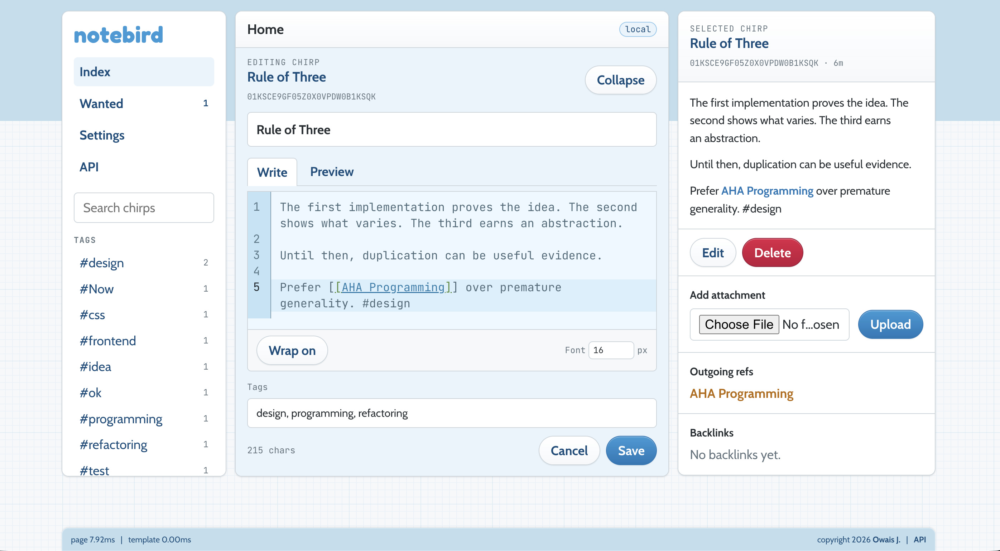

# Notebird

Notebird is a tiny local-first personal wiki designed to resemble old-school Twitter.



It runs as a local Go web app, stores Chirps (notes) in SQLite with attachments using
CAS on your local filesystem, supports Markdown with wiki links, and uses HTMX/Alpine
for small interactive updates. It almost functions entirely with the nobuild stack, but
markdown and wysiwyg editing require CodeMirror & ProseMirror, which are bundled via
esbuild.

## Requirements

- Go 1.26+
- [`just`](https://github.com/casey/just)
- [`pnpm`](https://pnpm.io/)
- Optional: [`air`](https://github.com/air-verse/air) for Go hot reload

If Air is not installed, `just dev` falls back to `go run github.com/air-verse/air@latest`.
You can optionally `just run` to start the server without hot reload.

### Stack

- Go server and CLI
- SQLite persistence
- Commonmark compliant markdown, extended with `[[Wiki Links]]`
  - Notes/markdown files are TiddlyWiki-inspired **Chirps** with ULID identity
- Fully featured editors
  - CodeMirror Markdown composer with server-rendered preview
  - ProseMirror WYSIWYG composer with Markdown source sync
  - esbuild for CodeMirror & ProseMirror
- Vendored HTMX, Alpine, and local fonts
  - HTMX-powered feed/detail updates, with Alpine sprinkles for interactivity
- Charmbracelet libs for CLI/logging polish

## Run locally

```sh
just run
```

Then open:

```text
http://127.0.0.1:7331
```

By default Notebird stores data in your user config directory under `notebird`. For a throwaway local DB:

```sh
go run ./cmd/notebird --data-dir ./tmp/dev-data
```

## Development

Install and build frontend assets:

```sh
just assets-install
just assets
```

Run with Go hot reload via Air:

```sh
just dev
```

Run `just` to view all available commands.
